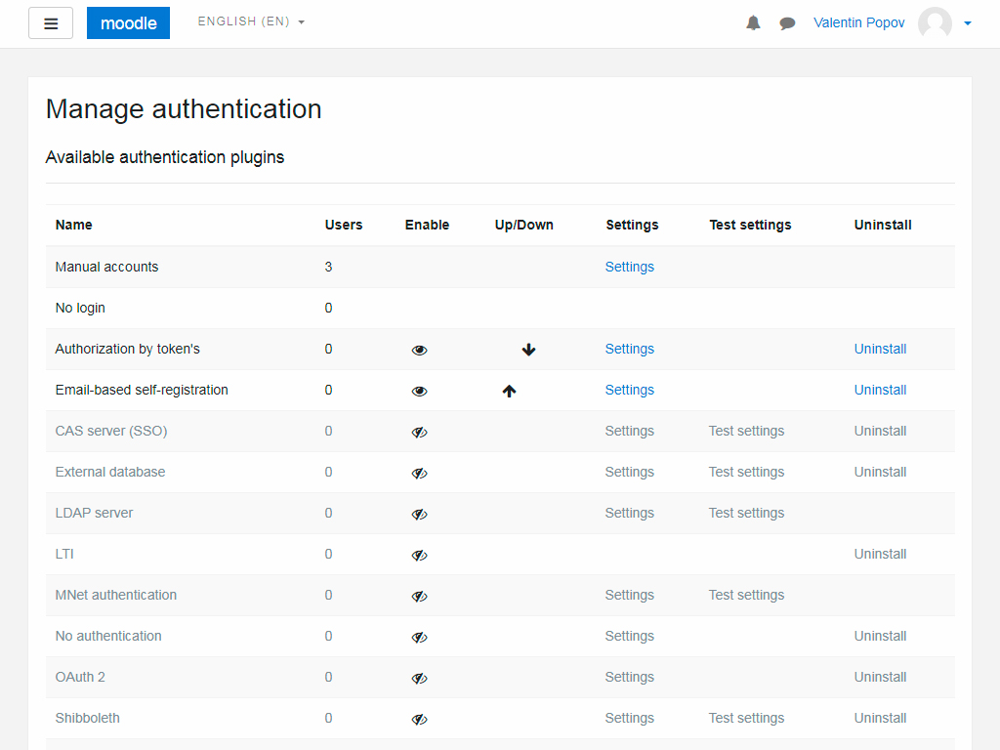

# Getting Started

## Navigation

* [Installation](#installation);
    * [Build](#build);
* [User's Manual](#users-manual);

## Installation

Get the installation package in any of the available methods:

* [GitHub Releases](https://github.com/valentineus/moodle-auth_token/releases).
* [Compilation from the source code](#build).

### Build

Self-assembly package is as follows:

* Clone the repository:
```bash
git clone https://github.com/valentineus/moodle-auth_token.git moodle-auth_token
```

* Run the build script:
```bash
cd ./moodle-auth_token
/bin/sh build.sh
```

## User's Manual

An authentication plug-in is a method of handling user authentication to Moodle when users log into your site.
You can have one or more methods as the same time enabled on your site, but each user can only use one method of authentication at a time.

You must enable and configure the method, as you need for your users in `Site administration` > `Plugins` > `Authentication` > `Manage authentication`.
Note that the order of processing on this page does matter and after `manual` and `nologin`, you should next put the method that most users will have.



The authentication plug-in has no configuration.
This means that the third-party plug-in is responsible for setting the keys.

**Note**:
Users will not receive any error or other message when they try to log in but it simply will not allow them in.

To authenticate a user, create a link for it:

```Text
/login/index.php?token=secret
```

The authentication plug-in does not add graphical forms to the user.
This means that custom forms are created by developers for a particular task.